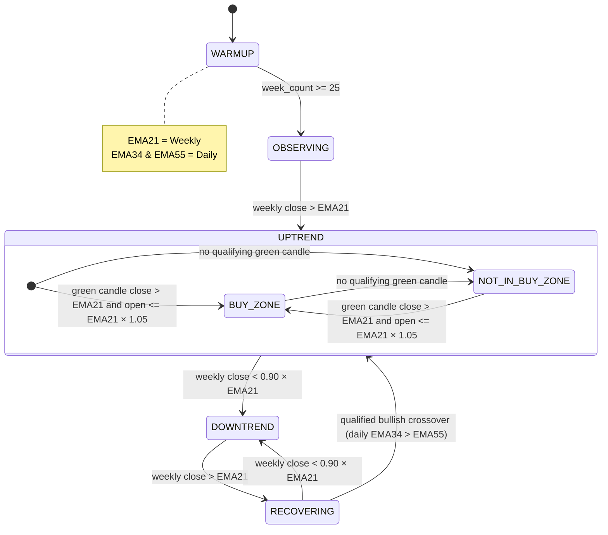

# Trend Rider V0.81 - Design Reference

---

## 1. Indicators

| Indicator | Timeframe | Library | Purpose |
| --- | --- | --- | --- |
| EMA21 | Weekly | TA-Lib | Primary trend line and official trend boundary reference |
| EMA34 | Daily | TA-Lib | Positive crossover confirmation |
| EMA55 | Daily | TA-Lib | Positive crossover confirmation |

**Zone Definitions**

Buy Zone:

* Green candle close > open on a daily or weekly candle
* close > EMA21
* open <= EMA21 × 1.05
* A candle may close above EMA21 × 1.05 and still qualify if it opened below or inside the upper boundary

Above Buy Zone:

* close > EMA21 × 1.05

Downtrend Trigger:

* close < EMA21 × 0.90
* Weekly close is the official end boundary

**Boundary Behaviour**

* Daily EMA21 crosses are confirmation evidence only
* Weekly close above EMA21 is the official uptrend start boundary
* Weekly close below `0.90 × EMA21` is the official downtrend end boundary
* The confirmation week is excluded from `#weeks`, strength, duration, and performance counts
* The exact week the trend starts after a recovery crossover is also excluded from the weekly statistics until the next weekly candle is processed
* The exact week the downtrend trigger fires is excluded from the ending cycle statistics

---

## 2. State Machine

**Key transition rules**

* Weekly confirmation creates the official trend start date
* Daily EMA21 crosses are recorded as evidence, not as official boundaries
* `RECOVERING` is a recovery phase, not an analytics-counted uptrend phase; it blocks buy signals until the first valid post-recovery bullish crossover and qualification rules pass
* The recovery week is the weekly candle that first moves back above EMA21; the first bullish crossover (EMA34 > EMA55) confirms the recovered uptrend, and analytics for that cycle begin from the weekly recovery anchor instead of counting the recovery week itself
* Buy signals are gated by `tr_qualified == True`
* `tr_qualified` is a one-way latch and never resets

---

## 3. Trend Qualification

* `tr_qualified` becomes `True` when `uptrend_weeks >= 40` for the first time
* It never resets, even after a downtrend
* The warmup period is configurable and counts weekly candles only

---

## 4. Uptrend Record

Tracked per uptrend cycle:

* `start_date`, `end_date`
* `first_buy_zone_date`, `first_buy_zone_price`
* `daily_ema21_cross_date`, `daily_ema21_cross_price`
* `daily_downtrend_trigger_date`, `daily_downtrend_trigger_price`
* `num_weeks`, `closes_above_ema`, `closes_below_ema`, `pct_closes_above`, `strength`
* `highest_price`, `highest_price_date`
* `lowest_price`, `lowest_price_date`
* `ROC 1W`, `ROC 3W`, `ROC 6M`, `ROC 9M`
* `max_profit_pct` from the first official buy zone
* `trend_roc_pct` from the first official buy zone
* `ATH price/date`
* `distance_from_ath_abs`, `distance_from_ath_pct`
* `ema21_slope`, `ema34_55_spread`, `ema34_55_spread_pct`, `efficiency_ratio`

Strength thresholds:

* `< 0.70` -> WEAK
* `0.70 - 0.80` -> DEVELOPING
* `0.80 - 0.90` -> MODERATE
* `0.90 - 1.00` -> STRONG
* `1.00` -> SUPER_STRONG

---

## 5. Classification

* `RECOVERING` is shown as `RECOVERING`
* `tr_qualified == False` -> `UNQUALIFIED`
* `tr_qualified == True` and `uptrend_weeks >= 40` -> `PRIME` or `PRIME_WAITLIST`
* `tr_qualified == True` and `uptrend_weeks < 40` -> `MOMENTUM` or `MOMENTUM_WAITLIST`

---

## 6. Signals

| Signal | Timeframe | Trigger |
| --- | --- | --- |
| UPTREND_START | Weekly | Official weekly close above EMA21 |
| BUY_ENTRY | Daily | First qualifying bullish crossover after trend qualification |
| REENTRY | Weekly | TR-qualified stock re-enters the buy zone |
| MOMENTUM_ENTRY | Daily | Qualified bullish crossover during RECOVERING |
| DOWNTREND_START | Weekly | Weekly close below `0.90 × EMA21` |
| EMA_CROSSOVER | Daily | EMA34 crosses above EMA55 |
| TR_QUALIFIED | Weekly | Uptrend weeks hit 40 |

Every signal stores:

* `ticker`
* `signal_type`
* `date`
* `close`
* `ema21`
* `ema34`
* `ema55`
* `timeframe`
* `state`
* `trend_cycle_id`
* `trend_start_date`
* `trend_end_date`

---

## 7. Trade Manager

* Entry on `BUY_ENTRY`, `REENTRY`, or `MOMENTUM_ENTRY`
* Daily market-on-close buy entries use `min(close, EMA21 × 1.05)` as the base fill price
* Daily entry fill price applies default slippage of `0.0005`: `execution_price = base_fill_price × (1 + slippage)`
* One open trade per stock at a time
* A new eligible signal can still be persisted even if the trade manager declines to open another trade
* Target, stop loss, and trailing stop logic remain unchanged

---

## 8. Processing Pipeline

### Full Scan

1. Download daily OHLC data
2. Resample to weekly (`W-FRI`)
3. Compute EMA21 on weekly, EMA34 and EMA55 on daily
4. Compute weekly zone flags
5. Sort by `(date, _order)` so daily rows always process before weekly rows on the same date
6. Feed candles chronologically through the FSM
7. Persist signals, trend events, and normalized cycle analytics
8. Finalize the active cycle and classification
9. Save the context snapshot and write the queryable trend tables
10. Optionally export the debug CSV

### Incremental Update

1. Load the persisted context
2. Restore the FSM state with `machine.set_state(...)`
3. Apply incremental EMAs to new candles
4. Sort by `(date, _order)` with daily before weekly on the same date
5. Feed the new candles through the FSM
6. Save updated context, signals, trend events, and analytics

---

## 9. Persistence Model

* `stock_states` - serialized `StockContext` with query columns
* `trend_cycles` - official trend boundaries and confirmation observations
* `trend_analytics` - per-cycle analytics summary
* `trend_events` - daily confirmations, daily triggers, qualification, and official boundary events
* `signals` - queryable signal stream with explicit columns for timeframe, state, and cycle linkage
* `trades` - every `TradeRecord`

---

## 10. Key Test Cases

* Daily EMA21 cross is captured as confirmation evidence
* Official trend start is the weekly close date
* Confirmation week is excluded from counts
* Official trend end is the weekly close below `0.90 × EMA21`
* Ending week is excluded from counts
* `RECOVERING` blocks buy signals
* No buy before qualification
* First eligible crossover emits exactly one buy signal
* Duplicate buy emission is blocked on the same crossover
* ROC, max profit, ATH, and distance-from-ATH are calculated from the first official buy zone
* Persistence round-trips the new queryable tables cleanly

### Simple example

If a stock falls below EMA21 and then closes above EMA21 on week W, that week is marked `RECOVERING`. The next valid daily bullish crossover (EMA34 > EMA55) confirms the recovered cycle, and the weekly recovery week stays as the official anchor for that cycle. The weekly statistics for the recovered cycle begin from that anchor week onward, and the week that triggered the downtrend is not included in the final cycle counts.

Example:

* Week A: price closes below EMA21 -> downtrend week
* Week B: price closes above EMA21 -> `RECOVERING` week
* Day C inside Week B: EMA34 > EMA55 -> new uptrend start
* Week C onward: `Weeks`, `% Above EMA`, and strength are calculated from the post-start period only

---

## 11. Design Change Log

| Date | Description | Affected Components |
| --- | --- | --- |
| 2026-06-09 | Clarified Pine buy-zone background marking: daily and other non-weekly chart intervals must test the chart interval's own OHLC directly; higher-timeframe security data may provide EMA band context but must not replace the interval OHLC candle rule. | Pine indicator, Pine strategy, TradingView docs |
| 2026-06-09 | Refined Buy Zone to green candles with close above EMA21 and open at or below the upper band; capped daily MOC entry fills at the upper band before applying 0.05% slippage. | `trend_rider_lib`, Pine indicator, Pine strategy, tests |
